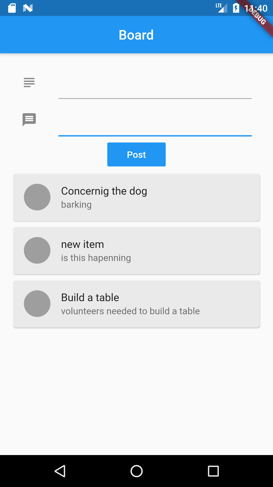
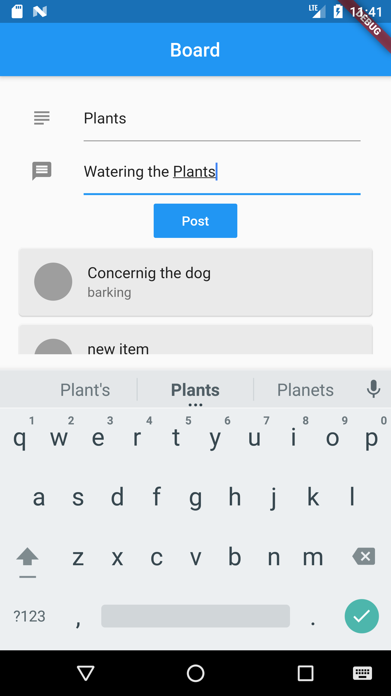
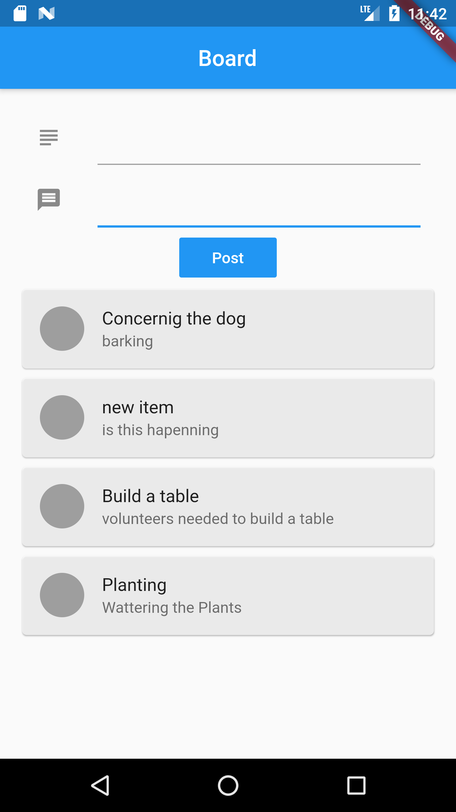

## database_intro 
# using realtime database (FIREBASE)

A new Flutter project.
A simple app to explore google firebase and its features that lead us to making of a robust application in future.
Here in this app simple input of data and displaying it to the screen by a FirebaseAnimatorListView.
Realtime Database is used to create and read the database.

||

## Getting Started

This project is a starting point for a Flutter application.

A few resources to get you started if this is your first Flutter project:

- [Lab: Write your first Flutter app](https://flutter.dev/docs/get-started/codelab)
- [Cookbook: Useful Flutter samples](https://flutter.dev/docs/cookbook)

For help getting started with Flutter, view our
[online documentation](https://flutter.dev/docs), which offers tutorials,
samples, guidance on mobile development, and a full API reference.
